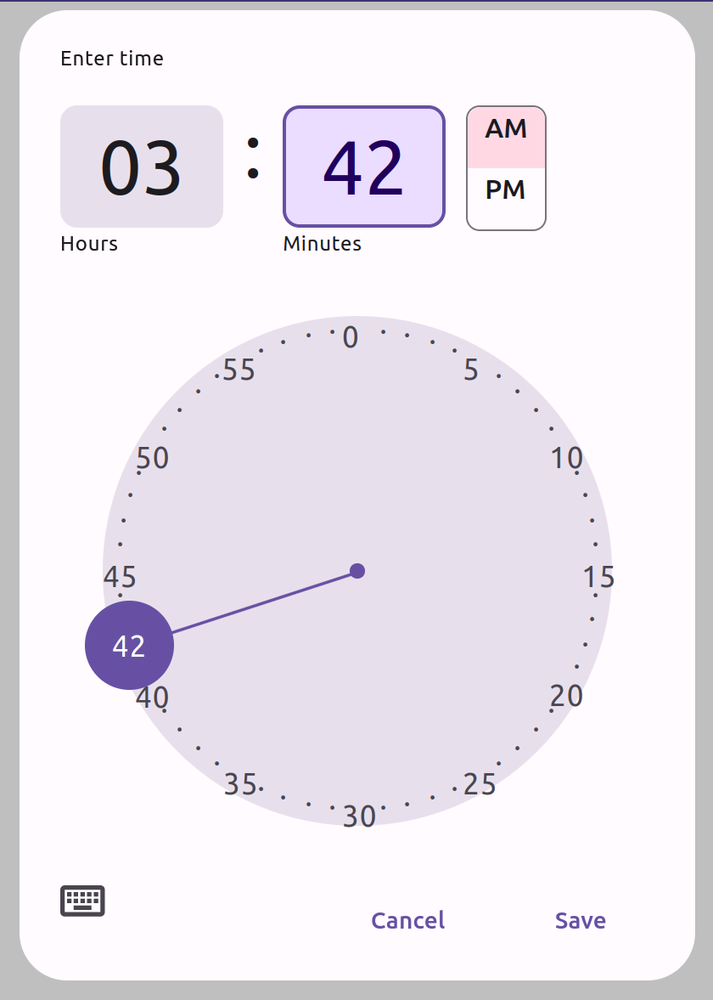

# TimePicker

TimePicker is a user interface component that allows the user to easily select a specific time. It provides an analog clock interface that is easy to use and intuitive. TimePicker can be easily integrated into other user interface components, making it a perfect choice for applications that require the user to select a time.

## Features

- The user can enter the number either using the keyboard or using the mouse/pointer on the analog clock.
- The clock React component is responsive and works well on different devices and screen sizes.
- The clock's appearance is based on Material design v3 with more features to improve the user experience for time input.
- The user can pick a time by either clicking on a number or dragging the clock hand.
- When the user clicks on a number the clock hand is designed to smoothly move towards it. ( moves clockwise or counterclockwise ).
- When the user releases the clock hand after dragging it to select a time, it will snap to the nearest number.

## Installation

To install TimePicker, run the following command:

`npm install react-material-time-picker`

## Interactive Demo


To see TimePicker in action, you can use the following link: https://mz39tu.csb.app/.

## Usage

To use TimePicker in your React application, import the TimePicker component and use it in your JSX code:

import TimePicker from 'react-material-time-picker';

Once you have imported the component, you can use it in your app as follows:

```jsx
const App = () => {
    const [ show,setShow ] = useState(false);
    const [ theme,setTheme ] = useState('light');
    return (<>
      <button onClick={()=>setShow(true)}>
        Click Me!
      </button>
      <button onClick={()=>setTheme(theme === 'dark' ? 'light': 'dark')}>
        { theme }
      </button>
        <TimePicker
              theme={ theme }
              title={ 'Time' }
              clockWidth={ 300 }
              zIndex={ 1003 }
              style={{ width:'300px',top:'0' }}
              onChange={ checkValidity }
              show={ show }
              defaultValue={ '1246' }
              hide={ ()=>setShow(false) }
              buttons={[
                {
                  label:'Cancel',
                  onClick: ()=>setShow(false)
                },
                {
                  label:'Save',
                  onClick: ()=>alert('Saved!')
                }
              ]}
              colors={{
                    light:{
                        primary : '#6750A4',
                        surfaceVariant: 'rgba(231, 224, 236, 1)',
                        onSurfaceVariant: '#49454F',
                        onSurface: '#1C1B1F',
                        outline: '#79747E',
                        scrim:'rgb(0,0,0,0.25)',
                        tertiaryContainer:'#FFD8E4',
                        onPrimary: '#ffffff',
                        errorContainer: '#F9DEDC',
                        primaryContainer: '#EADDFF',
                        onPrimaryContainer: '#21005D',
                        error : '#B3261E',
                        surface3: `linear-gradient(0deg, #FFFBFE, #FFFBFE),` +
                            `linear-gradient(0deg, rgba(103, 80, 164, 0.11), rgba(103, 80, 164, 0.11))`
            
                    },
                    dark: {
                        primary : '#D0BCFF',
                        surfaceVariant: '#49454F',
                        onSurfaceVariant: '#CAC4D0',
                        onSurface: '#E6E1E5',
                        outline: '#79747E',
                        scrim:'rgb(0,0,0,0.25)',
                        tertiaryContainer:'#633B48',
                        onPrimary: '#381E72',
                        errorContainer: '#8C1D18',
                        primaryContainer: '#4F378B',
                        onPrimaryContainer: '#EADDFF',
                        error : '#F2B8B5',
                        surface3: 'linear-gradient(0deg, #1C1B1F, #1C1B1F),' +
                            '    linear-gradient(0deg, rgba(208, 188, 255, 0.11), rgba(208, 188, 255, 0.11))'
                    }
                }}
      />
    </>)
};
```


## Props

TimePicker has the following props:

- `title`: The title that will be displayed at the top of the TimePicker modal.
- `hide`: A function for hiding the modal from the page
- `show`: A boolean value for showing the modal
- `buttons`: An array including One or more buttons that will be placed at the bottom of the modal. These button objects must include function which will trigger after clicking on the button named 'onClick',and the label of the button named 'label'.
- `onChange`: Is a function which takes the updated time value in every changes happening.
- `defaultValue`: Is an optional value of time at the beginning in form of a 4 characters string.
- `theme` : Which can have two values of 'light' or 'dark'. This variable has set 'light' by default.
- `zIndex`: Is an optional value of the modal z-index, and by default is 1001
- `style`: Is an optional variable for styling the component. Can be used for changing font-family and etc.
- `clockWidth`: Is an optional variable for the diameter of the clockFace, needs to be at least 100px. 
- `colors`: An optional variable in form of an object including two possible themes light and dark

### `Colors` Variables

Each of the objects in the light and dark modes must include the following variables:
- `primary`: a CSS color value that represents the primary color of the theme 
- `surfaceVariant`: a CSS color value that represents the surface variant color of the theme 
- `onSurfaceVariant`: a CSS color value that represents the color of text or other elements on top of the surface variant color
- `surface`: a CSS color value that represents the surface color of the theme
- `onSurface`: a CSS color value that represents the color of text or other elements on top of the surface color
- `outline`: a CSS color value that represents borders color of the theme
- `scrim`: a CSS color value that represents the scrim color of the theme
- `tertiaryContainer`: a CSS color value that represents the tertiary container color of the theme
- `onPrimary`: a CSS color value that represents the color of text or other elements on top of the primary color
- `errorContainer`: a CSS color value that represents the error container color of the theme
- `primaryContainer`: a CSS color value that represents the primary container color of the theme
- `onPrimaryContainer`: a CSS color value that represents the color of text or other elements on top of the primary container color
- `error`: a CSS color value that represents the error color of the theme
- `surface3`: a CSS color value that represents the background color of the theme


